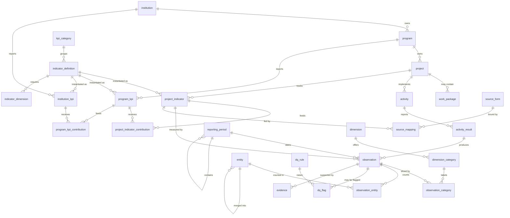

# Database schema reference

Complete reference for the `kpi` schema: **54 tables**, **28 views**, **18 functions**, **28 triggers** and **13 enumerated types**.

This document is **generated from the live database** by `tools/build_schema_docs.py`, so it cannot drift from the schema it describes. Column descriptions come from `COMMENT ON` statements in `schema/10_comments.sql`, which means `psql \d+` and Adminer show the same text. Regenerate with `make schema-docs`.

For *why* the schema is shaped this way, read [Schema-Design.md](Schema-Design.md). This file is the *what*.

---

## Contents

- [Conventions](#conventions)
- [Entity relationships](#entity-relationships)
- [Enumerated types](#enumerated-types)
- [Tables](#tables)
  - [Reference data](#reference-data)
  - [Organisation hierarchy](#organisation-hierarchy)
  - [Reporting calendar](#reporting-calendar)
  - [Disaggregation axes](#disaggregation-axes)
  - [KPI catalogue](#kpi-catalogue)
  - [The three KPI levels](#the-three-kpi-levels)
  - [KPI Mapping Table](#kpi-mapping-table)
  - [Targets and performance bands](#targets-and-performance-bands)
  - [Activities and results](#activities-and-results)
  - [Countable-entity registry](#countable-entity-registry)
  - [Observations](#observations)
  - [Snapshots](#snapshots)
  - [Ingestion and staging](#ingestion-and-staging)
  - [Data quality](#data-quality)
  - [Access control and audit](#access-control-and-audit)
  - [Alerts](#alerts)
  - [Source form mapping](#source-form-mapping)
- [Views](#views)
- [Functions](#functions)
- [Triggers](#triggers)

---

## Conventions

These hold throughout, and are not repeated on every table.

**Keys.** Every entity table has a surrogate `id bigint generated always as identity`. Natural keys (`code`, ISO codes, external references) carry their own unique constraints. Join tables use composite primary keys instead of a surrogate.

**Timestamps.** `created_at` and `updated_at` are `timestamptz` defaulting to `now()`. `updated_at` is maintained by the `kpi.set_updated_at()` trigger on tables where history matters; the database is set to UTC so period boundaries are stable regardless of where a client connects from.

**Soft state, not deletion.** Nothing that has been reported is deleted. Mappings are `retired`, snapshots are `superseded`, duplicate entities are `merged_into_id`, and failing records are flagged. This is what makes a historical figure reproducible.

**Naming.** `_ck` is a check constraint, `_uq` a unique constraint or index, `_idx` a plain index, `_fkey` a foreign key. Views are prefixed `v_`. Trigger functions are prefixed `tg_`.

**Approval workflow.** Tables carrying reported data (`activity_result`, `observation`) share a `status` plus `recorded_by` / `recorded_at` and `validated_by` / `validated_at`. A check constraint requires the validation stamp once `status` reaches `validated` or `rejected`. Only `validated` rows are eligible for publication.

**Effective dating.** Mapping tables carry `mapping_status` plus `effective_from` / `effective_to`, and a partial unique index permits only one non-retired row per pair. A `null` `effective_to` means open-ended. Changing a mapping means retiring the old row and inserting a new one, never editing in place.

**Deferred contract triggers.** A few checks span more than one table &mdash; an observation and the rows that justify it. Those run as `deferrable initially deferred` constraint triggers, firing at commit, so parent and child rows can be inserted in any order within a transaction. They raise rather than warn: a transform that violates them aborts.

---

## Entity relationships

The core of the model. Governance, staging, access control and alerting are omitted for legibility; they are documented in full below.

---

## Enumerated types

Postgres enums rather than lookup tables, because these are closed sets that change only with a schema change &mdash; and because an invalid value then fails at write time rather than surviving to a report.

| Type | Values |
|---|---|
| `aggregation_method` | `sum`, `distinct_count`, `ratio`, `weighted_average`, `latest`, `average`, `max`, `min` |
| `approval_status` | `draft`, `submitted`, `validated`, `rejected`, `superseded` |
| `data_source` | `activity_rollup`, `direct_entry`, `external_system`, `calculated` |
| `direction` | `increase`, `decrease`, `maintain` |
| `dq_flag_status` | `open`, `under_review`, `resolved`, `waived` |
| `dq_severity` | `info`, `warning`, `error` |
| `entity_type` | `person`, `organization`, `publication`, `thesis`, `variety`, `innovation`, `engagement_event`, `award`, `proposal` |
| `lifecycle_status` | `planned`, `active`, `on_hold`, `completed`, `cancelled` |
| `mapping_status` | `draft`, `validated`, `retired` |
| `org_level` | `institution`, `program`, `project` |
| `period_type` | `month`, `quarter`, `semester`, `year`, `custom` |
| `source_value_mode` | `count_rows`, `distinct_entity`, `sum_field`, `value_field`, `ratio_fields` |
| `value_type` | `count`, `decimal`, `currency`, `percentage`, `ratio`, `index_score` |

---

## Tables

## Reference data

*Defined in `schema/01_core.sql`.*

Shared lookups describing *where* and *what* a result concerned. These are drill-down and filter axes rather than part of any indicator's disaggregation contract, so they hang off observations as optional foreign keys.

### `country`

ISO 3166 country reference. Framework 13.1 requires coded geography rather than free text.

| Column | Type | Null | Default | Description |
|---|---|---|---|---|
| `id` | `bigint` | no | `identity` |  |
| `iso3166_alpha2` | `character(2)` | no |  | Two-letter ISO 3166-1 code; the natural key. |
| `iso3166_alpha3` | `character(3)` | yes |  |  |
| `name` | `text` | no |  |  |
| `region` | `text` | yes |  | Operating region grouping, e.g. West Africa. |
| `is_active` | `boolean` | no | `true` |  |

**Constraints**

- `country_pkey` &mdash; *Primary key* `PRIMARY KEY (id)`
- `country_iso3166_alpha2_key` &mdash; *Unique* `UNIQUE (iso3166_alpha2)`
- `country_iso3166_alpha3_key` &mdash; *Unique* `UNIQUE (iso3166_alpha3)`

### `location`

Sub-national places within a country, nested to any depth via parent_id.

| Column | Type | Null | Default | Description |
|---|---|---|---|---|
| `id` | `bigint` | no | `identity` |  |
| `country_id` | `bigint` | no |  | &rarr; `country.id` |
| `code` | `text` | no |  |  |
| `name` | `text` | no |  |  |
| `admin_level` | `smallint` | yes |  | 1 = state or province, 2 = LGA or district. |
| `parent_id` | `bigint` | yes |  | Containing location, for admin hierarchies. &rarr; `location.id` |
| `latitude` | `numeric(9,6)` | yes |  |  |
| `longitude` | `numeric(9,6)` | yes |  |  |
| `is_active` | `boolean` | no | `true` |  |

**Constraints**

- `location_latitude_ck` &mdash; *Check* `CHECK (((latitude IS NULL) OR ((latitude >= ('-90'::integer)::numeric) AND (latitude <= (90)::numeric))))`
- `location_longitude_ck` &mdash; *Check* `CHECK (((longitude IS NULL) OR ((longitude >= ('-180'::integer)::numeric) AND (longitude <= (180)::numeric))))`
- `location_pkey` &mdash; *Primary key* `PRIMARY KEY (id)`
- `location_code_per_country_uq` &mdash; *Unique* `UNIQUE (country_id, code)`

**Indexes**

- `location_country_idx` &mdash; `USING btree (country_id)`
- `location_parent_idx` &mdash; `USING btree (parent_id)`

### `commodity`

Crops and value chains used to slice results.

| Column | Type | Null | Default | Description |
|---|---|---|---|---|
| `id` | `bigint` | no | `identity` |  |
| `code` | `text` | no |  |  |
| `name` | `text` | no |  |  |
| `crop_group` | `text` | yes |  | Grouping such as roots and tubers, or grain legumes. |
| `is_active` | `boolean` | no | `true` |  |

**Constraints**

- `commodity_pkey` &mdash; *Primary key* `PRIMARY KEY (id)`
- `commodity_code_key` &mdash; *Unique* `UNIQUE (code)`

### `partner`

Partner organisations: delivery partners, ARIs, scaling partners, private sector.

| Column | Type | Null | Default | Description |
|---|---|---|---|---|
| `id` | `bigint` | no | `identity` |  |
| `code` | `text` | no |  |  |
| `name` | `text` | no |  |  |
| `partner_type` | `text` | yes |  | ARI, NARS, Scaling, Private sector. |
| `country_id` | `bigint` | yes |  | &rarr; `country.id` |
| `external_ref` | `text` | yes |  | Authoritative external identifier, e.g. a ROR id. |
| `is_active` | `boolean` | no | `true` |  |
| `created_at` | `timestamp with time zone` | no | `now()` |  |

**Constraints**

- `partner_pkey` &mdash; *Primary key* `PRIMARY KEY (id)`
- `partner_code_key` &mdash; *Unique* `UNIQUE (code)`

**Indexes**

- `partner_country_idx` &mdash; `USING btree (country_id)`

---

## Organisation hierarchy

*Defined in `schema/01_core.sql`.*

Institution > Program > Project > Work package. There is one institution, so `institution` holds one row; it exists because institutional KPIs and targets need something to hang from.

### `institution`

Top of the hierarchy (the institution). Expected to hold exactly one row; it anchors institutional KPIs and their targets.

| Column | Type | Null | Default | Description |
|---|---|---|---|---|
| `id` | `bigint` | no | `identity` |  |
| `code` | `text` | no |  |  |
| `name` | `text` | no |  |  |
| `description` | `text` | yes |  |  |
| `country_id` | `bigint` | yes |  | &rarr; `country.id` |
| `is_active` | `boolean` | no | `true` |  |
| `created_at` | `timestamp with time zone` | no | `now()` |  |
| `updated_at` | `timestamp with time zone` | no | `now()` |  |

**Constraints**

- `institution_code_ck` &mdash; *Check* `CHECK (((code = TRIM(BOTH FROM code)) AND (code <> ''::text)))`
- `institution_pkey` &mdash; *Primary key* `PRIMARY KEY (id)`

**Indexes**

- `institution_code_uq` &mdash; `unique USING btree (lower(code))`

### `program`

A program groups projects and owns program-level KPIs.

| Column | Type | Null | Default | Description |
|---|---|---|---|---|
| `id` | `bigint` | no | `identity` |  |
| `institution_id` | `bigint` | no |  | &rarr; `institution.id` |
| `code` | `text` | no |  |  |
| `name` | `text` | no |  |  |
| `description` | `text` | yes |  |  |
| `program_leader` | `text` | yes |  | Named accountable owner for the program scorecard. |
| `start_date` | `date` | yes |  |  |
| `end_date` | `date` | yes |  |  |
| `status` | `lifecycle_status` | no | `'active'::lifecycle_status` |  |
| `created_at` | `timestamp with time zone` | no | `now()` |  |
| `updated_at` | `timestamp with time zone` | no | `now()` |  |

**Constraints**

- `program_dates_ck` &mdash; *Check* `CHECK (((end_date IS NULL) OR (start_date IS NULL) OR (end_date >= start_date)))`
- `program_pkey` &mdash; *Primary key* `PRIMARY KEY (id)`
- `program_code_uq` &mdash; *Unique* `UNIQUE (institution_id, code)`

**Indexes**

- `program_institution_idx` &mdash; `USING btree (institution_id)`

### `project`

Delivery unit. Implements activities and owns project indicators.

| Column | Type | Null | Default | Description |
|---|---|---|---|---|
| `id` | `bigint` | no | `identity` |  |
| `program_id` | `bigint` | no |  | &rarr; `program.id` |
| `code` | `text` | no |  |  |
| `name` | `text` | no |  |  |
| `description` | `text` | yes |  |  |
| `project_manager` | `text` | yes |  |  |
| `donor` | `text` | yes |  | Funder, for donor reporting and filtering. |
| `start_date` | `date` | yes |  |  |
| `end_date` | `date` | yes |  |  |
| `status` | `lifecycle_status` | no | `'active'::lifecycle_status` |  |
| `budget_amount` | `numeric(18,2)` | yes |  | Indicative project budget; not used in KPI calculation. |
| `budget_currency` | `character(3)` | yes | `'USD'::bpchar` |  |
| `created_at` | `timestamp with time zone` | no | `now()` |  |
| `updated_at` | `timestamp with time zone` | no | `now()` |  |

**Constraints**

- `project_dates_ck` &mdash; *Check* `CHECK (((end_date IS NULL) OR (start_date IS NULL) OR (end_date >= start_date)))`
- `project_pkey` &mdash; *Primary key* `PRIMARY KEY (id)`
- `project_code_uq` &mdash; *Unique* `UNIQUE (program_id, code)`

**Indexes**

- `project_program_idx` &mdash; `USING btree (program_id)`

### `work_package`

Optional component grouping between project and activity, used where a project is structured into work packages.

| Column | Type | Null | Default | Description |
|---|---|---|---|---|
| `id` | `bigint` | no | `identity` |  |
| `project_id` | `bigint` | no |  | &rarr; `project.id` |
| `code` | `text` | no |  |  |
| `name` | `text` | no |  |  |
| `description` | `text` | yes |  |  |
| `lead` | `text` | yes |  |  |
| `created_at` | `timestamp with time zone` | no | `now()` |  |

**Constraints**

- `work_package_pkey` &mdash; *Primary key* `PRIMARY KEY (id)`
- `work_package_code_uq` &mdash; *Unique* `UNIQUE (project_id, code)`

**Indexes**

- `work_package_project_idx` &mdash; `USING btree (project_id)`

### `project_country`

Countries a project operates in (many-to-many).

| Column | Type | Null | Default | Description |
|---|---|---|---|---|
| `project_id` | `bigint` | no |  | &rarr; `project.id` |
| `country_id` | `bigint` | no |  | &rarr; `country.id` |

**Constraints**

- `project_country_pkey` &mdash; *Primary key* `PRIMARY KEY (project_id, country_id)`

### `project_commodity`

Commodities a project works on (many-to-many).

| Column | Type | Null | Default | Description |
|---|---|---|---|---|
| `project_id` | `bigint` | no |  | &rarr; `project.id` |
| `commodity_id` | `bigint` | no |  | &rarr; `commodity.id` |

**Constraints**

- `project_commodity_pkey` &mdash; *Primary key* `PRIMARY KEY (project_id, commodity_id)`

### `project_partner`

Partner organisations attached to a project.

| Column | Type | Null | Default | Description |
|---|---|---|---|---|
| `project_id` | `bigint` | no |  | &rarr; `project.id` |
| `partner_id` | `bigint` | no |  | &rarr; `partner.id` |
| `role` | `text` | yes |  | How the partner participates, e.g. implementing or scaling. |

**Constraints**

- `project_partner_pkey` &mdash; *Primary key* `PRIMARY KEY (project_id, partner_id)`

---

## Reporting calendar

*Defined in `schema/01_core.sql`.*

One calendar for every level. Periods nest through `parent_period_id`, which is what lets projects report quarterly while the institution reports annually off the same observations — the two can never disagree because they are computed from the same rows.

### `reporting_period`

Shared reporting calendar. Periods nest via parent_period_id (2025-Q1 -> FY2025), so projects can report quarterly while the institution reports annually off the same observations.

| Column | Type | Null | Default | Description |
|---|---|---|---|---|
| `id` | `bigint` | no | `identity` |  |
| `code` | `text` | no |  |  |
| `name` | `text` | no |  |  |
| `period_type` | `period_type` | no |  | Granularity: month, quarter, semester, year or custom. |
| `fiscal_year` | `smallint` | no |  | Financial year the period belongs to. |
| `start_date` | `date` | no |  |  |
| `end_date` | `date` | no |  |  |
| `parent_period_id` | `bigint` | yes |  | The period that contains this one. Drives v_period_rollup, which lets one observation serve every enclosing period. &rarr; `reporting_period.id` |
| `is_open` | `boolean` | no | `true` | Data-entry gate. Closed periods reject new observations but still accept snapshots. |
| `published_at` | `timestamp with time zone` | yes |  | When results for this period were released. |
| `created_at` | `timestamp with time zone` | no | `now()` |  |

**Constraints**

- `reporting_period_dates_ck` &mdash; *Check* `CHECK ((end_date >= start_date))`
- `reporting_period_self_parent_ck` &mdash; *Check* `CHECK ((parent_period_id IS DISTINCT FROM id))`
- `reporting_period_pkey` &mdash; *Primary key* `PRIMARY KEY (id)`
- `reporting_period_code_key` &mdash; *Unique* `UNIQUE (code)`

**Indexes**

- `reporting_period_parent_idx` &mdash; `USING btree (parent_period_id)`
- `reporting_period_range_idx` &mdash; `USING btree (start_date, end_date)`
- `reporting_period_year_idx` &mdash; `USING btree (fiscal_year, period_type)`

---

## Disaggregation axes

*Defined in `schema/01_core.sql`.*

Sex, age band, degree level and anything else results are split by. Adding an axis is data entry, not a migration.

### `dimension`

A disaggregation axis such as sex, age band or degree level. Adding an axis is data entry, not a migration.

| Column | Type | Null | Default | Description |
|---|---|---|---|---|
| `id` | `bigint` | no | `identity` |  |
| `code` | `text` | no |  |  |
| `name` | `text` | no |  |  |
| `description` | `text` | yes |  |  |
| `sort_order` | `smallint` | no | `0` |  |
| `is_active` | `boolean` | no | `true` |  |

**Constraints**

- `dimension_pkey` &mdash; *Primary key* `PRIMARY KEY (id)`
- `dimension_code_key` &mdash; *Unique* `UNIQUE (code)`

### `dimension_category`

A value on a disaggregation axis, e.g. F or M on the SEX axis.

| Column | Type | Null | Default | Description |
|---|---|---|---|---|
| `id` | `bigint` | no | `identity` |  |
| `dimension_id` | `bigint` | no |  | &rarr; `dimension.id` |
| `code` | `text` | no |  | Short code that appears in observation.disaggregation_key. |
| `label` | `text` | no |  |  |
| `sort_order` | `smallint` | no | `0` |  |
| `is_active` | `boolean` | no | `true` |  |

**Constraints**

- `dimension_category_pkey` &mdash; *Primary key* `PRIMARY KEY (id)`
- `dimension_category_code_uq` &mdash; *Unique* `UNIQUE (dimension_id, code)`
- `dimension_category_id_dim_uq` &mdash; *Unique* `UNIQUE (id, dimension_id)`

**Indexes**

- `dimension_category_dimension_idx` &mdash; `USING btree (dimension_id)`

---

## KPI catalogue

*Defined in `schema/02_indicators.sql`.*

The KPI inventory of framework section 4.1. One definition per metric, reused at all three levels, so unit and aggregation method are declared once and cannot drift between levels.

### `kpi_category`

The five source categories: Research Outputs, Training and Capacity Building, Product Development, Recognition and Reputation, Society Impact and Inclusion.

| Column | Type | Null | Default | Description |
|---|---|---|---|---|
| `id` | `bigint` | no | `identity` |  |
| `code` | `text` | no |  |  |
| `name` | `text` | no |  |  |
| `description` | `text` | yes |  |  |
| `sort_order` | `smallint` | no | `0` |  |

**Constraints**

- `kpi_category_pkey` &mdash; *Primary key* `PRIMARY KEY (id)`
- `kpi_category_code_key` &mdash; *Unique* `UNIQUE (code)`

### `indicator_definition`

KPI inventory (framework 4.1). One row per metric, reused at project, program and institutional level so unit and aggregation method cannot drift between levels.

| Column | Type | Null | Default | Description |
|---|---|---|---|---|
| `id` | `bigint` | no | `identity` |  |
| `code` | `text` | no |  |  |
| `kpi_category_id` | `bigint` | yes |  | &rarr; `kpi_category.id` |
| `name` | `text` | no |  |  |
| `parent_indicator_id` | `bigint` | yes |  | Set on sub-indicators such as KPI 4a, which are derived from their parent's disaggregation rather than reported separately. &rarr; `indicator_definition.id` |
| `definition_text` | `text` | yes |  | The formal "what counts" wording. |
| `numerator_text` | `text` | yes |  | Narrative definition of the numerator (framework 4.1). |
| `denominator_text` | `text` | yes |  | Narrative definition of the denominator. |
| `value_type` | `value_type` | no |  | How the value is interpreted: count, decimal, currency, percentage, ratio or index_score. |
| `unit` | `text` | yes |  | Unit of measurement, e.g. papers, partners, %. Declared once in the catalogue so it cannot differ between levels. |
| `currency_code` | `character(3)` | yes |  |  |
| `aggregation_method` | `aggregation_method` | no | `'sum'::aggregation_method` | How children combine into a parent. Framework section 11 methods plus the ordinary statistical ones. |
| `distinct_entity_type` | `entity_type` | yes |  | Which kind of registry entity is de-duplicated. Required when aggregation_method is distinct_count, forbidden otherwise. |
| `direction` | `direction` | no | `'increase'::direction` | Whether increase, decrease or maintain is good. Drives achievement scoring. |
| `decimal_places` | `smallint` | no | `0` |  |
| `is_cumulative` | `boolean` | no | `false` | True when the KPI accumulates across time. Modelled separately from aggregation_method because it describes accumulation across periods, not how children combine into a parent. |
| `is_indexed` | `boolean` | no | `false` | True for the indexed 2025 source figures (framework 4.2), so a dashboard never presents them as raw counts. |
| `index_basis_note` | `text` | yes |  | What the indexed figure is indexed against, where known. |
| `reporting_frequency` | `period_type` | yes |  |  |
| `responsible_unit` | `text` | yes |  |  |
| `data_source_note` | `text` | yes |  |  |
| `requires_evidence` | `boolean` | no | `false` | When true, an observation must carry evidence before it can be validated (framework 13.1). |
| `max_level` | `org_level` | no | `'institution'::org_level` | Highest level the indicator may be used at. The org_level enum is ordered institution < program < project, so a cap of program forbids institutional use. |
| `definition_status` | `mapping_status` | no | `'draft'::mapping_status` | draft until the Program and MELIA teams validate the definition and calculation rule. Everything loaded by 06_seed_catalogue.sql is draft. |
| `validated_by` | `text` | yes |  |  |
| `validated_at` | `timestamp with time zone` | yes |  |  |
| `is_active` | `boolean` | no | `true` |  |
| `created_at` | `timestamp with time zone` | no | `now()` |  |
| `updated_at` | `timestamp with time zone` | no | `now()` |  |

**Constraints**

- `indicator_currency_ck` &mdash; *Check* `CHECK (((value_type = 'currency'::value_type) = (currency_code IS NOT NULL)))`
- `indicator_decimals_ck` &mdash; *Check* `CHECK (((decimal_places >= 0) AND (decimal_places <= 6)))`
- `indicator_distinct_entity_ck` &mdash; *Check* `CHECK (((aggregation_method = 'distinct_count'::aggregation_method) = (distinct_entity_type IS NOT NULL)))`
- `indicator_ratio_method_ck` &mdash; *Check* `CHECK (((value_type <> ALL (ARRAY['percentage'::value_type, 'ratio'::value_type])) OR (aggregation_method = ANY (ARRAY['ratio'::aggregation_method, 'latest'::aggregation_method, 'weighted_average'::aggregation_method]))))`
- `indicator_self_parent_ck` &mdash; *Check* `CHECK ((parent_indicator_id IS DISTINCT FROM id))`
- `indicator_validated_ck` &mdash; *Check* `CHECK (((definition_status <> 'validated'::mapping_status) OR (validated_at IS NOT NULL)))`
- `indicator_definition_pkey` &mdash; *Primary key* `PRIMARY KEY (id)`
- `indicator_definition_code_key` &mdash; *Unique* `UNIQUE (code)`

**Indexes**

- `indicator_category_idx` &mdash; `USING btree (kpi_category_id)`
- `indicator_parent_idx` &mdash; `USING btree (parent_indicator_id)`

### `indicator_dimension`

Disaggregation contract for an indicator. Required axes are enforced on observation insert (see 03_results.sql).

| Column | Type | Null | Default | Description |
|---|---|---|---|---|
| `indicator_definition_id` | `bigint` | no |  | &rarr; `indicator_definition.id` |
| `dimension_id` | `bigint` | no |  | &rarr; `dimension.id` |
| `is_required` | `boolean` | no | `true` | Required axes must appear on every observation; optional axes may appear and are still grouped by. |

**Constraints**

- `indicator_dimension_pkey` &mdash; *Primary key* `PRIMARY KEY (indicator_definition_id, dimension_id)`

---

## The three KPI levels

*Defined in `schema/02_indicators.sql`.*

Each table instantiates a catalogue definition at one level and adds ownership, baselines and scorecard weighting.

### `project_indicator`

Level 3. A KPI as tracked by one project, optionally scoped to a work package.

| Column | Type | Null | Default | Description |
|---|---|---|---|---|
| `id` | `bigint` | no | `identity` |  |
| `project_id` | `bigint` | no |  | &rarr; `project.id` |
| `indicator_definition_id` | `bigint` | no |  | &rarr; `indicator_definition.id` |
| `work_package_id` | `bigint` | yes |  | &rarr; `work_package.id` |
| `local_name` | `text` | yes |  | The project's own wording, e.g. "Partners trained - Component A". |
| `data_source` | `data_source` | no | `'activity_rollup'::data_source` | Where values come from: activity rollup, direct entry, an external system, or calculated. |
| `baseline_value` | `numeric(20,6)` | yes |  | Starting value the project measures change against. |
| `baseline_date` | `date` | yes |  | When the baseline was measured. |
| `responsible` | `text` | yes |  | Person accountable for reporting this indicator. |
| `is_active` | `boolean` | no | `true` |  |
| `created_at` | `timestamp with time zone` | no | `now()` |  |
| `updated_at` | `timestamp with time zone` | no | `now()` |  |

**Constraints**

- `project_indicator_pkey` &mdash; *Primary key* `PRIMARY KEY (id)`
- `project_indicator_uq` &mdash; *Unique* `UNIQUE (project_id, indicator_definition_id, work_package_id)`

**Indexes**

- `project_indicator_definition_idx` &mdash; `USING btree (indicator_definition_id)`
- `project_indicator_project_idx` &mdash; `USING btree (project_id)`

### `program_kpi`

Level 2. A KPI as reported by one program.

| Column | Type | Null | Default | Description |
|---|---|---|---|---|
| `id` | `bigint` | no | `identity` |  |
| `program_id` | `bigint` | no |  | &rarr; `program.id` |
| `indicator_definition_id` | `bigint` | no |  | &rarr; `indicator_definition.id` |
| `local_name` | `text` | yes |  | The program's own wording for the KPI, where it differs from the catalogue. |
| `baseline_value` | `numeric(20,6)` | yes |  | Starting value the program measures change against. |
| `baseline_date` | `date` | yes |  | When the baseline was measured. |
| `scorecard_weight` | `numeric(9,4)` | no | `1` | Relative importance within the program scorecard. Used for weighted achievement reporting, not for the rollup arithmetic. |
| `responsible` | `text` | yes |  | Person accountable for reporting this KPI. |
| `is_active` | `boolean` | no | `true` |  |
| `created_at` | `timestamp with time zone` | no | `now()` |  |
| `updated_at` | `timestamp with time zone` | no | `now()` |  |

**Constraints**

- `program_kpi_weight_ck` &mdash; *Check* `CHECK ((scorecard_weight >= (0)::numeric))`
- `program_kpi_pkey` &mdash; *Primary key* `PRIMARY KEY (id)`
- `program_kpi_uq` &mdash; *Unique* `UNIQUE (program_id, indicator_definition_id)`

**Indexes**

- `program_kpi_program_idx` &mdash; `USING btree (program_id)`

### `institution_kpi`

Level 1. A KPI as reported institution-wide.

| Column | Type | Null | Default | Description |
|---|---|---|---|---|
| `id` | `bigint` | no | `identity` |  |
| `institution_id` | `bigint` | no |  | &rarr; `institution.id` |
| `indicator_definition_id` | `bigint` | no |  | &rarr; `indicator_definition.id` |
| `local_name` | `text` | yes |  | The institution's own wording for the KPI, where it differs from the catalogue. |
| `strategic_objective` | `text` | yes |  | The strategy this KPI serves. |
| `baseline_value` | `numeric(20,6)` | yes |  | Starting value the institution measures change against. |
| `baseline_date` | `date` | yes |  | When the baseline was measured. |
| `scorecard_weight` | `numeric(9,4)` | no | `1` | Relative importance in the institutional scorecard; drives weighted category achievement. |
| `responsible` | `text` | yes |  | Person accountable for reporting this KPI. |
| `is_active` | `boolean` | no | `true` |  |
| `created_at` | `timestamp with time zone` | no | `now()` |  |
| `updated_at` | `timestamp with time zone` | no | `now()` |  |

**Constraints**

- `institution_kpi_weight_ck` &mdash; *Check* `CHECK ((scorecard_weight >= (0)::numeric))`
- `institution_kpi_pkey` &mdash; *Primary key* `PRIMARY KEY (id)`
- `institution_kpi_uq` &mdash; *Unique* `UNIQUE (institution_id, indicator_definition_id)`

**Indexes**

- `institution_kpi_institution_idx` &mdash; `USING btree (institution_id)`

---

## KPI Mapping Table

*Defined in `schema/02_indicators.sql`.*

Framework section 10.1. Many-to-many links between levels, versioned rather than overwritten so that historical figures stay reproducible when the results framework is realigned mid-year.

### `project_indicator_contribution`

KPI Mapping Table, project to program (framework 10.1). Many-to-many: one project indicator can feed several program KPIs. Rows are versioned, never overwritten, so historical figures stay reproducible.

| Column | Type | Null | Default | Description |
|---|---|---|---|---|
| `id` | `bigint` | no | `identity` |  |
| `project_indicator_id` | `bigint` | no |  | &rarr; `project_indicator.id` |
| `program_kpi_id` | `bigint` | no |  | &rarr; `program_kpi.id` |
| `contribution_factor` | `numeric(18,6)` | no | `1` | Unit conversion or attribution share applied to the child numerator. A trigger forbids anything other than 1 for ratio and percentage indicators, where scaling a numerator without its denominator would change the ratio. |
| `weight` | `numeric(18,6)` | no | `1` | Static weight used only when the parent aggregates by weighted_average. Data-driven weights live on the observation instead. |
| `effective_from` | `date` | yes |  | First date the mapping applies. |
| `effective_to` | `date` | yes |  | Last date the mapping applies; null means open-ended. |
| `mapping_status` | `mapping_status` | no | `'draft'::mapping_status` | draft, validated or retired. Only validated mappings feed published figures. |
| `validated_by` | `text` | yes |  |  |
| `validated_at` | `timestamp with time zone` | yes |  |  |
| `note` | `text` | yes |  |  |
| `created_at` | `timestamp with time zone` | no | `now()` |  |

**Constraints**

- `pic_dates_ck` &mdash; *Check* `CHECK (((effective_to IS NULL) OR (effective_from IS NULL) OR (effective_to >= effective_from)))`
- `pic_validated_ck` &mdash; *Check* `CHECK (((mapping_status <> 'validated'::mapping_status) OR (validated_at IS NOT NULL)))`
- `pic_weight_ck` &mdash; *Check* `CHECK ((weight >= (0)::numeric))`
- `project_indicator_contribution_pkey` &mdash; *Primary key* `PRIMARY KEY (id)`

**Indexes**

- `pic_live_uq` &mdash; `unique USING btree (project_indicator_id, program_kpi_id) WHERE (mapping_status <> 'retired'::mapping_status)`
- `pic_program_kpi_idx` &mdash; `USING btree (program_kpi_id)`

### `program_kpi_contribution`

KPI Mapping Table, program to institution. Same versioning rules as the project-to-program mapping.

| Column | Type | Null | Default | Description |
|---|---|---|---|---|
| `id` | `bigint` | no | `identity` |  |
| `program_kpi_id` | `bigint` | no |  | &rarr; `program_kpi.id` |
| `institution_kpi_id` | `bigint` | no |  | &rarr; `institution_kpi.id` |
| `contribution_factor` | `numeric(18,6)` | no | `1` | Unit conversion or attribution share; must be 1 for ratio and percentage indicators. |
| `weight` | `numeric(18,6)` | no | `1` | Static weight for weighted_average parents. |
| `effective_from` | `date` | yes |  | First date the mapping applies. |
| `effective_to` | `date` | yes |  | Last date the mapping applies; null means open-ended. |
| `mapping_status` | `mapping_status` | no | `'draft'::mapping_status` | draft, validated or retired. Only validated mappings feed published figures. |
| `validated_by` | `text` | yes |  |  |
| `validated_at` | `timestamp with time zone` | yes |  |  |
| `note` | `text` | yes |  |  |
| `created_at` | `timestamp with time zone` | no | `now()` |  |

**Constraints**

- `pkc_dates_ck` &mdash; *Check* `CHECK (((effective_to IS NULL) OR (effective_from IS NULL) OR (effective_to >= effective_from)))`
- `pkc_validated_ck` &mdash; *Check* `CHECK (((mapping_status <> 'validated'::mapping_status) OR (validated_at IS NOT NULL)))`
- `pkc_weight_ck` &mdash; *Check* `CHECK ((weight >= (0)::numeric))`
- `program_kpi_contribution_pkey` &mdash; *Primary key* `PRIMARY KEY (id)`

**Indexes**

- `pkc_institution_kpi_idx` &mdash; `USING btree (institution_kpi_id)`
- `pkc_live_uq` &mdash; `unique USING btree (program_kpi_id, institution_kpi_id) WHERE (mapping_status <> 'retired'::mapping_status)`

---

## Targets and performance bands

*Defined in `schema/02_indicators.sql`.*

Separate target tables per level rather than one polymorphic table, so the foreign keys are real. Bands turn achievement into a traffic light.

### `project_indicator_target`

Targets per project indicator, period and disaggregation slice. Separate tables per level rather than one polymorphic table, so the foreign keys are real.

| Column | Type | Null | Default | Description |
|---|---|---|---|---|
| `project_indicator_id` | `bigint` | no |  | &rarr; `project_indicator.id` |
| `reporting_period_id` | `bigint` | no |  | &rarr; `reporting_period.id` |
| `disaggregation_key` | `text` | no | `''::text` | Empty string is the overall target; a non-empty key targets one slice. |
| `target_value` | `numeric(20,6)` | no |  | Target for this period. Achievement is scored against it respecting the indicator's direction. |
| `cumulative_target` | `numeric(20,6)` | yes |  | Life-of-project target, where one is set. |
| `note` | `text` | yes |  |  |
| `created_at` | `timestamp with time zone` | no | `now()` |  |

**Constraints**

- `project_indicator_target_pkey` &mdash; *Primary key* `PRIMARY KEY (project_indicator_id, reporting_period_id, disaggregation_key)`

### `program_kpi_target`

Targets per program KPI, period and disaggregation slice.

| Column | Type | Null | Default | Description |
|---|---|---|---|---|
| `program_kpi_id` | `bigint` | no |  | &rarr; `program_kpi.id` |
| `reporting_period_id` | `bigint` | no |  | &rarr; `reporting_period.id` |
| `disaggregation_key` | `text` | no | `''::text` | Empty string is the overall target; a non-empty key targets one slice. |
| `target_value` | `numeric(20,6)` | no |  | Target for this period, scored respecting the indicator's direction. |
| `cumulative_target` | `numeric(20,6)` | yes |  | Multi-year cumulative target, where one is set. |
| `note` | `text` | yes |  |  |
| `created_at` | `timestamp with time zone` | no | `now()` |  |

**Constraints**

- `program_kpi_target_pkey` &mdash; *Primary key* `PRIMARY KEY (program_kpi_id, reporting_period_id, disaggregation_key)`

### `institution_kpi_target`

Targets per institutional KPI, period and disaggregation slice.

| Column | Type | Null | Default | Description |
|---|---|---|---|---|
| `institution_kpi_id` | `bigint` | no |  | &rarr; `institution_kpi.id` |
| `reporting_period_id` | `bigint` | no |  | &rarr; `reporting_period.id` |
| `disaggregation_key` | `text` | no | `''::text` | Empty string is the overall target; a non-empty key targets one slice. |
| `target_value` | `numeric(20,6)` | no |  | Target for this period, scored respecting the indicator's direction. |
| `cumulative_target` | `numeric(20,6)` | yes |  | Multi-year cumulative target, where one is set. |
| `note` | `text` | yes |  |  |
| `created_at` | `timestamp with time zone` | no | `now()` |  |

**Constraints**

- `institution_kpi_target_pkey` &mdash; *Primary key* `PRIMARY KEY (institution_kpi_id, reporting_period_id, disaggregation_key)`

### `performance_band`

Traffic-light thresholds (framework section 14). Bands are matched on achievement against target, so a KPI with no target has no band.

| Column | Type | Null | Default | Description |
|---|---|---|---|---|
| `id` | `bigint` | no | `identity` |  |
| `code` | `text` | no |  |  |
| `label` | `text` | no |  |  |
| `min_achievement` | `numeric(8,4)` | yes |  | Inclusive lower bound, as a percentage of target. |
| `max_achievement` | `numeric(8,4)` | yes |  | Exclusive upper bound, as a percentage of target. |
| `colour_hex` | `character(7)` | yes |  |  |
| `sort_order` | `smallint` | no | `0` |  |

**Constraints**

- `performance_band_range_ck` &mdash; *Check* `CHECK (((min_achievement IS NULL) OR (max_achievement IS NULL) OR (max_achievement > min_achievement)))`
- `performance_band_pkey` &mdash; *Primary key* `PRIMARY KEY (id)`
- `performance_band_code_key` &mdash; *Unique* `UNIQUE (code)`

---

## Activities and results

*Defined in `schema/03_results.sql`.*

Steps 1 and 2 of the result chain. `activity_result` is the narrative and evidence envelope; the numbers live in `observation`, so one reported result can feed several indicators and slices.

### `activity`

Step 1 of the result chain: work implemented by a project, with the context it happened in.

| Column | Type | Null | Default | Description |
|---|---|---|---|---|
| `id` | `bigint` | no | `identity` |  |
| `project_id` | `bigint` | no |  | &rarr; `project.id` |
| `work_package_id` | `bigint` | yes |  | &rarr; `work_package.id` |
| `code` | `text` | no |  |  |
| `name` | `text` | no |  |  |
| `description` | `text` | yes |  |  |
| `country_id` | `bigint` | yes |  | &rarr; `country.id` |
| `location_id` | `bigint` | yes |  | &rarr; `location.id` |
| `commodity_id` | `bigint` | yes |  | &rarr; `commodity.id` |
| `planned_start` | `date` | yes |  | Planned start; compared against actuals for delivery reporting. |
| `planned_end` | `date` | yes |  |  |
| `actual_start` | `date` | yes |  | Actual start. A trigger requires activity dates to fall inside the project dates (framework 13.1). |
| `actual_end` | `date` | yes |  |  |
| `status` | `lifecycle_status` | no | `'planned'::lifecycle_status` |  |
| `responsible` | `text` | yes |  | Person or team accountable for delivery. |
| `created_at` | `timestamp with time zone` | no | `now()` |  |
| `updated_at` | `timestamp with time zone` | no | `now()` |  |

**Constraints**

- `activity_actual_dates_ck` &mdash; *Check* `CHECK (((actual_end IS NULL) OR (actual_start IS NULL) OR (actual_end >= actual_start)))`
- `activity_planned_dates_ck` &mdash; *Check* `CHECK (((planned_end IS NULL) OR (planned_start IS NULL) OR (planned_end >= planned_start)))`
- `activity_pkey` &mdash; *Primary key* `PRIMARY KEY (id)`
- `activity_code_uq` &mdash; *Unique* `UNIQUE (project_id, code)`

**Indexes**

- `activity_commodity_idx` &mdash; `USING btree (commodity_id)`
- `activity_country_idx` &mdash; `USING btree (country_id)`
- `activity_project_idx` &mdash; `USING btree (project_id)`

### `activity_partner`

Partner organisations involved in an activity.

| Column | Type | Null | Default | Description |
|---|---|---|---|---|
| `activity_id` | `bigint` | no |  | &rarr; `activity.id` |
| `partner_id` | `bigint` | no |  | &rarr; `partner.id` |
| `role` | `text` | yes |  |  |

**Constraints**

- `activity_partner_pkey` &mdash; *Primary key* `PRIMARY KEY (activity_id, partner_id)`

### `activity_result`

Step 2: the narrative and evidence envelope for one activity in one reporting period. The numbers themselves live in observation, so one reported result can feed several indicators and slices.

| Column | Type | Null | Default | Description |
|---|---|---|---|---|
| `id` | `bigint` | no | `identity` |  |
| `activity_id` | `bigint` | no |  | &rarr; `activity.id` |
| `reporting_period_id` | `bigint` | no |  | &rarr; `reporting_period.id` |
| `result_date` | `date` | no |  | Date the result was achieved, not the date it was entered. |
| `title` | `text` | yes |  |  |
| `narrative` | `text` | yes |  |  |
| `status` | `approval_status` | no | `'draft'::approval_status` | Approval state. Only validated results contribute to published figures. |
| `recorded_by` | `text` | yes |  |  |
| `recorded_at` | `timestamp with time zone` | no | `now()` |  |
| `validated_by` | `text` | yes |  | Who approved it. Required once status is validated or rejected. |
| `validated_at` | `timestamp with time zone` | yes |  |  |
| `created_at` | `timestamp with time zone` | no | `now()` |  |
| `updated_at` | `timestamp with time zone` | no | `now()` |  |

**Constraints**

- `activity_result_validated_ck` &mdash; *Check* `CHECK (((status = ANY (ARRAY['validated'::approval_status, 'rejected'::approval_status])) = (validated_at IS NOT NULL)))`
- `activity_result_pkey` &mdash; *Primary key* `PRIMARY KEY (id)`

**Indexes**

- `activity_result_activity_idx` &mdash; `USING btree (activity_id)`
- `activity_result_period_idx` &mdash; `USING btree (reporting_period_id, status)`

### `evidence`

Supporting documents for a result or an observation: DOIs, thesis records, release gazettes, attendance sheets.

| Column | Type | Null | Default | Description |
|---|---|---|---|---|
| `id` | `bigint` | no | `identity` |  |
| `activity_result_id` | `bigint` | yes |  | &rarr; `activity_result.id` |
| `observation_id` | `bigint` | yes |  | &rarr; `observation.id` |
| `uri` | `text` | no |  | Object-store key, URL or DOI. |
| `evidence_type` | `text` | yes |  | What kind of proof this is, e.g. DOI, gazette, attendance_sheet. |
| `media_type` | `text` | yes |  |  |
| `title` | `text` | yes |  |  |
| `description` | `text` | yes |  |  |
| `uploaded_by` | `text` | yes |  |  |
| `uploaded_at` | `timestamp with time zone` | no | `now()` |  |

**Constraints**

- `evidence_owner_ck` &mdash; *Check* `CHECK ((num_nonnulls(activity_result_id, observation_id) >= 1))`
- `evidence_pkey` &mdash; *Primary key* `PRIMARY KEY (id)`

**Indexes**

- `evidence_observation_idx` &mdash; `USING btree (observation_id)`
- `evidence_result_idx` &mdash; `USING btree (activity_result_id)`

---

## Countable-entity registry

*Defined in `schema/03_results.sql`.*

The thing that makes `COUNT(DISTINCT ...)` possible. Eight of the twenty KPIs count people and organisations that more than one project reports; a reported total cannot be de-duplicated, but a named list can.

### `entity`

Registry of the things that must not be double counted: students, partners, ARIs, publications, theses, varieties, innovations, engagement events, proposals. Eight of the twenty KPIs aggregate by COUNT(DISTINCT) against this table, which is impossible from a reported total alone.

| Column | Type | Null | Default | Description |
|---|---|---|---|---|
| `id` | `bigint` | no | `identity` |  |
| `entity_type` | `entity_type` | no |  | What kind of thing this is; must match the indicator's distinct_entity_type. |
| `display_name` | `text` | no |  |  |
| `external_ref` | `text` | yes |  | Authoritative external identifier where one exists: ORCID, DOI, ROR, gazette number, student registration. |
| `external_ref_system` | `text` | yes |  | Which register external_ref belongs to. |
| `canonical_key` | `text` | yes | `lower(regexp_replace(display_name, '[^a-z...` | Generated normalised form of display_name, used for fuzzy duplicate detection before a distinct count runs. |
| `country_id` | `bigint` | yes |  | &rarr; `country.id` |
| `partner_id` | `bigint` | yes |  | &rarr; `partner.id` |
| `is_personal_data` | `boolean` | no | `false` | Marks records holding personal data, so role-based access can mask them (framework 7.2, 18). |
| `merged_into_id` | `bigint` | yes |  | Points at the surviving record when two rows turn out to be the same real-world entity. Every distinct count follows this pointer; records are merged, never deleted, so the audit trail survives. Merge chains are rejected. &rarr; `entity.id` |
| `merged_at` | `timestamp with time zone` | yes |  |  |
| `merged_by` | `text` | yes |  |  |
| `attributes` | `jsonb` | no | `'{}'::jsonb` | Free-form additional properties carried from the source system. |
| `created_at` | `timestamp with time zone` | no | `now()` |  |
| `updated_at` | `timestamp with time zone` | no | `now()` |  |

**Constraints**

- `entity_merge_stamp_ck` &mdash; *Check* `CHECK (((merged_into_id IS NOT NULL) = (merged_at IS NOT NULL)))`
- `entity_self_merge_ck` &mdash; *Check* `CHECK ((merged_into_id IS DISTINCT FROM id))`
- `entity_pkey` &mdash; *Primary key* `PRIMARY KEY (id)`

**Indexes**

- `entity_canonical_idx` &mdash; `USING btree (entity_type, canonical_key)`
- `entity_external_ref_uq` &mdash; `unique USING btree (entity_type, external_ref_system, external_ref) WHERE (external_ref IS NOT NULL)`
- `entity_merged_idx` &mdash; `USING btree (merged_into_id)`

### `entity_duplicate_candidate`

Suspected duplicates awaiting a data steward decision, raised before distinct-count aggregation runs (framework 13.1).

| Column | Type | Null | Default | Description |
|---|---|---|---|---|
| `id` | `bigint` | no | `identity` |  |
| `entity_id` | `bigint` | no |  | &rarr; `entity.id` |
| `duplicate_of_id` | `bigint` | no |  | &rarr; `entity.id` |
| `match_score` | `numeric(5,4)` | yes |  | Confidence between 0 and 1. |
| `match_method` | `text` | yes |  | How the candidate was found: exact_external_ref, canonical_key, trigram. |
| `status` | `dq_flag_status` | no | `'open'::dq_flag_status` |  |
| `reviewed_by` | `text` | yes |  |  |
| `reviewed_at` | `timestamp with time zone` | yes |  |  |
| `detected_at` | `timestamp with time zone` | no | `now()` |  |

**Constraints**

- `edc_distinct_ck` &mdash; *Check* `CHECK ((entity_id <> duplicate_of_id))`
- `edc_score_ck` &mdash; *Check* `CHECK (((match_score IS NULL) OR ((match_score >= (0)::numeric) AND (match_score <= (1)::numeric))))`
- `entity_duplicate_candidate_pkey` &mdash; *Primary key* `PRIMARY KEY (id)`
- `edc_pair_uq` &mdash; *Unique* `UNIQUE (entity_id, duplicate_of_id)`

**Indexes**

- `edc_open_idx` &mdash; `USING btree (status) WHERE (status = 'open'::dq_flag_status)`

---

## Observations

*Defined in `schema/03_results.sql`.*

The single grain. Every number enters the system here, and every rollup reads from here.

### `observation`

Step 3: one measured value for one project indicator, period and disaggregation slice. This is the single grain every rollup reads from. A null activity_result_id means direct entry, a survey or an import; non-null means it came from a recorded activity.

| Column | Type | Null | Default | Description |
|---|---|---|---|---|
| `id` | `bigint` | no | `identity` |  |
| `project_indicator_id` | `bigint` | no |  | &rarr; `project_indicator.id` |
| `reporting_period_id` | `bigint` | no |  | &rarr; `reporting_period.id` |
| `activity_result_id` | `bigint` | yes |  | The activity result this value came from. Null for direct entry, survey or platform import. &rarr; `activity_result.id` |
| `observed_on` | `date` | no |  | When the value was measured; drives latest-status aggregation. |
| `numerator` | `numeric(20,6)` | no |  | The measured quantity. For ratio and percentage indicators it is the numerator only; for distinct counts it must equal the number of distinct entities listed in observation_entity, which a deferred trigger enforces. |
| `denominator` | `numeric(20,6)` | yes |  | Populated only for ratio and percentage indicators, and required for them. Carrying it to every level is what lets each level recombine the parts and divide once, instead of averaging percentages. |
| `conversion_factor` | `numeric(18,6)` | no | `1` | Applied when the raw result is recorded in a different unit, or when only part of it counts toward this indicator. |
| `weight` | `numeric(18,6)` | no | `1` | Data-driven weight for weighted_average indicators, e.g. trial or plot count for genetic gain. It accumulates upward, so the weighting survives above project level rather than degrading into a simple average. |
| `country_id` | `bigint` | yes |  | Drill-down context, inherited from the activity when not stated. &rarr; `country.id` |
| `location_id` | `bigint` | yes |  | &rarr; `location.id` |
| `commodity_id` | `bigint` | yes |  | Drill-down context, inherited from the activity when not stated. &rarr; `commodity.id` |
| `partner_id` | `bigint` | yes |  | Drill-down context: the partner this value relates to, where relevant. &rarr; `partner.id` |
| `disaggregation_key` | `text` | no | `''::text` | Denormalised fingerprint of observation_category, maintained by trigger. Empty string means no disaggregation. Lets every rollup group by a single column. |
| `status` | `approval_status` | no | `'draft'::approval_status` | Approval state. Only validated observations with no open blocking data-quality flag reach a published figure. |
| `source_system` | `text` | yes |  | Which platform the value arrived from. |
| `source_record_ref` | `text` | yes |  | Key in the originating platform, for round-trip traceability. |
| `source_note` | `text` | yes |  |  |
| `recorded_by` | `text` | yes |  |  |
| `validated_by` | `text` | yes |  |  |
| `validated_at` | `timestamp with time zone` | yes |  |  |
| `created_at` | `timestamp with time zone` | no | `now()` |  |
| `updated_at` | `timestamp with time zone` | no | `now()` |  |

**Constraints**

- `observation_denominator_ck` &mdash; *Check* `CHECK (((denominator IS NULL) OR (denominator >= (0)::numeric)))`
- `observation_factor_ck` &mdash; *Check* `CHECK ((conversion_factor > (0)::numeric))`
- `observation_validated_ck` &mdash; *Check* `CHECK (((status = ANY (ARRAY['validated'::approval_status, 'rejected'::approval_status])) = (validated_at IS NOT NULL)))`
- `observation_weight_ck` &mdash; *Check* `CHECK ((weight >= (0)::numeric))`
- `observation_pkey` &mdash; *Primary key* `PRIMARY KEY (id)`

**Indexes**

- `observation_commodity_idx` &mdash; `USING btree (commodity_id)`
- `observation_country_idx` &mdash; `USING btree (country_id)`
- `observation_direct_uq` &mdash; `unique USING btree (project_indicator_id, reporting_period_id, disaggregation_key) WHERE (activity_result_id IS NULL)`
- `observation_from_result_uq` &mdash; `unique USING btree (activity_result_id, project_indicator_id, disaggregation_key) WHERE (activity_result_id IS NOT NULL)`
- `observation_indicator_period_idx` &mdash; `USING btree (project_indicator_id, reporting_period_id, status)`
- `observation_key_idx` &mdash; `USING btree (disaggregation_key)`
- `observation_result_idx` &mdash; `USING btree (activity_result_id)`

### `observation_category`

The disaggregation slice of an observation: one row per axis. A composite foreign key proves the category belongs to the dimension it is filed under.

| Column | Type | Null | Default | Description |
|---|---|---|---|---|
| `observation_id` | `bigint` | no |  | &rarr; `observation.id` |
| `dimension_id` | `bigint` | no |  | &rarr; `dimension_category.dimension_id` |
| `dimension_category_id` | `bigint` | no |  | &rarr; `dimension_category.id` |

**Constraints**

- `observation_category_pkey` &mdash; *Primary key* `PRIMARY KEY (observation_id, dimension_id)`

**Indexes**

- `observation_category_cat_idx` &mdash; `USING btree (dimension_category_id)`

### `observation_entity`

Names the entities behind a count so program and institutional rollups can COUNT(DISTINCT) instead of summing project totals.

| Column | Type | Null | Default | Description |
|---|---|---|---|---|
| `observation_id` | `bigint` | no |  | &rarr; `observation.id` |
| `entity_id` | `bigint` | no |  | &rarr; `entity.id` |
| `note` | `text` | yes |  |  |

**Constraints**

- `observation_entity_pkey` &mdash; *Primary key* `PRIMARY KEY (observation_id, entity_id)`

**Indexes**

- `observation_entity_entity_idx` &mdash; `USING btree (entity_id)`

---

## Snapshots

*Defined in `schema/05_rollups.sql`.*

The rollup views always reflect current data. A snapshot preserves what was actually reported for a period, so a published figure survives a later restatement.

### `kpi_snapshot`

Frozen copy of computed values for one reporting period across all three levels. The rollup views always reflect current data; a snapshot preserves what was actually reported, so a board pack still reconciles after a project restates its figures. Earlier runs for a period are marked superseded rather than deleted.

| Column | Type | Null | Default | Description |
|---|---|---|---|---|
| `id` | `bigint` | no | `identity` |  |
| `org_level` | `org_level` | no |  | Which level this row belongs to; exactly one of the three KPI foreign keys is set. |
| `institution_kpi_id` | `bigint` | yes |  | &rarr; `institution_kpi.id` |
| `program_kpi_id` | `bigint` | yes |  | &rarr; `program_kpi.id` |
| `project_indicator_id` | `bigint` | yes |  | &rarr; `project_indicator.id` |
| `reporting_period_id` | `bigint` | no |  | &rarr; `reporting_period.id` |
| `disaggregation_key` | `text` | no | `''::text` |  |
| `numerator` | `numeric(20,6)` | yes |  |  |
| `denominator` | `numeric(20,6)` | yes |  |  |
| `value` | `numeric(20,6)` | yes |  | The derived value at snapshot time. |
| `target_value` | `numeric(20,6)` | yes |  |  |
| `achievement_pct` | `numeric(12,4)` | yes |  | Achievement against target at snapshot time, respecting indicator direction. |
| `contributor_count` | `integer` | yes |  | Contributing projects or programs, depending on level. |
| `observation_count` | `integer` | yes |  |  |
| `status` | `approval_status` | no | `'draft'::approval_status` | superseded once a later snapshot replaces it. |
| `computed_at` | `timestamp with time zone` | no | `now()` |  |
| `computed_by` | `text` | yes |  |  |
| `note` | `text` | yes |  |  |

**Constraints**

- `kpi_snapshot_level_match_ck` &mdash; *Check* `CHECK ((((org_level = 'institution'::org_level) AND (institution_kpi_id IS NOT NULL)) OR ((org_level = 'program'::org_level) AND (program_kpi_id IS NOT NULL)) OR ((org_level = 'project'::org_level) AND (project_indicator_id IS NOT NULL))))`
- `kpi_snapshot_one_owner_ck` &mdash; *Check* `CHECK ((num_nonnulls(institution_kpi_id, program_kpi_id, project_indicator_id) = 1))`
- `kpi_snapshot_pkey` &mdash; *Primary key* `PRIMARY KEY (id)`

**Indexes**

- `kpi_snapshot_live_uq` &mdash; `unique USING btree (COALESCE(institution_kpi_id, (0)::bigint), COALESCE(program_kpi_id, (0)::bigint), COALESCE(project_indicator_id, (0)::bigint), reporting_period_id, disaggregation_key) WHERE (status <> 'superseded'::approval_status)`
- `kpi_snapshot_period_idx` &mdash; `USING btree (reporting_period_id, org_level)`

---

## Ingestion and staging

*Defined in `schema/04_governance.sql`.*

Architecture layers 3 and 4. Raw payloads are retained before transformation; records that fail validation stop here and never become observations.

### `ingestion_batch`

One extraction run from a source platform (architecture layer 3).

| Column | Type | Null | Default | Description |
|---|---|---|---|---|
| `id` | `bigint` | no | `identity` |  |
| `source_system` | `text` | no |  |  |
| `integration_mode` | `text` | no |  | api, file_etl or db_replica — framework section 12's three patterns. |
| `source_reference` | `text` | yes |  | File name, API cursor or export id; also serves as the incremental high-water mark. |
| `started_at` | `timestamp with time zone` | no | `now()` |  |
| `completed_at` | `timestamp with time zone` | yes |  |  |
| `record_count` | `integer` | yes |  |  |
| `accepted_count` | `integer` | yes |  | Records that passed validation and became observations. |
| `flagged_count` | `integer` | yes |  | Records held by a data-quality rule. |
| `status` | `text` | no | `'running'::text` |  |
| `error_text` | `text` | yes |  | Failure detail when the batch itself did not complete. |
| `initiated_by` | `text` | yes |  |  |

**Constraints**

- `ingestion_batch_status_ck` &mdash; *Check* `CHECK ((status = ANY (ARRAY['running'::text, 'succeeded'::text, 'failed'::text])))`
- `ingestion_batch_pkey` &mdash; *Primary key* `PRIMARY KEY (id)`

**Indexes**

- `ingestion_batch_started_idx` &mdash; `USING btree (started_at DESC)`

### `staging_record`

Raw extracted data retained for traceability before transformation (architecture layer 4). Records that fail validation stop here and never become observations, so a published figure can always be traced back to the bytes the source platform actually sent.

| Column | Type | Null | Default | Description |
|---|---|---|---|---|
| `id` | `bigint` | no | `identity` |  |
| `ingestion_batch_id` | `bigint` | no |  | &rarr; `ingestion_batch.id` |
| `source_entity` | `text` | no |  |  |
| `source_record_ref` | `text` | yes |  |  |
| `payload` | `jsonb` | no |  | The untransformed submission body, exactly as received. |
| `received_at` | `timestamp with time zone` | no | `now()` |  |
| `processed_at` | `timestamp with time zone` | yes |  | When the transform last ran against this record. |
| `observation_id` | `bigint` | yes |  | The observation this raw record eventually became, if any. &rarr; `observation.id` |
| `process_status` | `text` | no | `'pending'::text` | pending, transformed, flagged, rejected or skipped. |
| `error_text` | `text` | yes |  | Why this record could not be transformed. |

**Constraints**

- `staging_process_status_ck` &mdash; *Check* `CHECK ((process_status = ANY (ARRAY['pending'::text, 'transformed'::text, 'flagged'::text, 'rejected'::text, 'skipped'::text])))`
- `staging_record_pkey` &mdash; *Primary key* `PRIMARY KEY (id)`

**Indexes**

- `staging_batch_idx` &mdash; `USING btree (ingestion_batch_id)`
- `staging_payload_idx` &mdash; `USING gin (payload)`
- `staging_source_idx` &mdash; `USING btree (source_entity, source_record_ref)`
- `staging_status_idx` &mdash; `USING btree (process_status)`

---

## Data quality

*Defined in `schema/04_governance.sql`.*

Framework section 13. Rules are configuration rather than code. Failures are flagged and withheld from published figures, never deleted.

### `dq_rule`

Validation rules as configuration rather than code, so MELIA and data staff can add checks without a deployment. Each rule names one of the framework's seven quality dimensions.

| Column | Type | Null | Default | Description |
|---|---|---|---|---|
| `id` | `bigint` | no | `identity` |  |
| `code` | `text` | no |  |  |
| `name` | `text` | no |  |  |
| `dimension` | `text` | no |  | One of completeness, accuracy, consistency, timeliness, validity, uniqueness, integrity. |
| `description` | `text` | yes |  |  |
| `severity` | `dq_severity` | no | `'error'::dq_severity` | Default severity applied to flags this rule raises. |
| `blocks_publication` | `boolean` | no | `true` | When true, an open flag withholds the value from published figures. When false the value still publishes and the flag is advisory. |
| `indicator_definition_id` | `bigint` | yes |  | Narrows the rule to one indicator; null applies it to all. &rarr; `indicator_definition.id` |
| `check_expression` | `text` | yes |  | SQL predicate evaluated by the validation job; text because rules are authored at runtime. |
| `is_active` | `boolean` | no | `true` |  |
| `created_at` | `timestamp with time zone` | no | `now()` |  |

**Constraints**

- `dq_rule_dimension_ck` &mdash; *Check* `CHECK ((dimension = ANY (ARRAY['completeness'::text, 'accuracy'::text, 'consistency'::text, 'timeliness'::text, 'validity'::text, 'uniqueness'::text, 'integrity'::text])))`
- `dq_rule_pkey` &mdash; *Primary key* `PRIMARY KEY (id)`
- `dq_rule_code_key` &mdash; *Unique* `UNIQUE (code)`

### `dq_flag`

Validation failures. Records are flagged and excluded from published figures, never deleted (framework 13). Exactly one target column is set, identifying the record the flag applies to.

| Column | Type | Null | Default | Description |
|---|---|---|---|---|
| `id` | `bigint` | no | `identity` |  |
| `dq_rule_id` | `bigint` | no |  | &rarr; `dq_rule.id` |
| `observation_id` | `bigint` | yes |  | &rarr; `observation.id` |
| `activity_result_id` | `bigint` | yes |  | &rarr; `activity_result.id` |
| `staging_record_id` | `bigint` | yes |  | &rarr; `staging_record.id` |
| `entity_id` | `bigint` | yes |  | &rarr; `entity.id` |
| `status` | `dq_flag_status` | no | `'open'::dq_flag_status` | open, under_review, resolved or waived. Resolving a flag restores the value with no re-entry. |
| `severity` | `dq_severity` | no |  | Copied from the rule at detection time, so re-grading a rule does not rewrite history. |
| `detail` | `text` | yes |  | What specifically failed, for the person who has to fix it. |
| `detected_at` | `timestamp with time zone` | no | `now()` |  |
| `detected_by` | `text` | yes |  |  |
| `resolved_at` | `timestamp with time zone` | yes |  |  |
| `resolved_by` | `text` | yes |  |  |
| `resolution_note` | `text` | yes |  |  |

**Constraints**

- `dq_flag_resolved_ck` &mdash; *Check* `CHECK (((status = ANY (ARRAY['resolved'::dq_flag_status, 'waived'::dq_flag_status])) = (resolved_at IS NOT NULL)))`
- `dq_flag_target_ck` &mdash; *Check* `CHECK ((num_nonnulls(observation_id, activity_result_id, staging_record_id, entity_id) = 1))`
- `dq_flag_pkey` &mdash; *Primary key* `PRIMARY KEY (id)`

**Indexes**

- `dq_flag_observation_idx` &mdash; `USING btree (observation_id) WHERE (observation_id IS NOT NULL)`
- `dq_flag_open_idx` &mdash; `USING btree (status) WHERE (status = ANY (ARRAY['open'::dq_flag_status, 'under_review'::dq_flag_status]))`
- `dq_flag_rule_idx` &mdash; `USING btree (dq_rule_id)`

---

## Access control and audit

*Defined in `schema/04_governance.sql`.*

Framework sections 15, 16 and 18. Scopes bound a user to an institution, program or project; the audit log records both data changes and KPI recalculations.

### `app_user`

Dashboard users (framework section 15).

| Column | Type | Null | Default | Description |
|---|---|---|---|---|
| `id` | `bigint` | no | `identity` |  |
| `username` | `text` | no |  | Login name; the natural key. |
| `email` | `text` | no |  |  |
| `full_name` | `text` | no |  |  |
| `external_idp_ref` | `text` | yes |  | Subject identifier from the identity provider, for single sign-on. |
| `is_active` | `boolean` | no | `true` |  |
| `last_login_at` | `timestamp with time zone` | yes |  |  |
| `created_at` | `timestamp with time zone` | no | `now()` |  |

**Constraints**

- `app_user_pkey` &mdash; *Primary key* `PRIMARY KEY (id)`
- `app_user_email_key` &mdash; *Unique* `UNIQUE (email)`
- `app_user_username_key` &mdash; *Unique* `UNIQUE (username)`

### `app_role`

Named roles: executive, program leader, project manager, MELIA, data admin, viewer.

| Column | Type | Null | Default | Description |
|---|---|---|---|---|
| `id` | `bigint` | no | `identity` |  |
| `code` | `text` | no |  |  |
| `name` | `text` | no |  |  |
| `description` | `text` | yes |  |  |
| `can_view_personal_data` | `boolean` | no | `false` | Whether the role may see unmasked entity records marked is_personal_data. |

**Constraints**

- `app_role_pkey` &mdash; *Primary key* `PRIMARY KEY (id)`
- `app_role_code_key` &mdash; *Unique* `UNIQUE (code)`

### `app_user_role`

Role grants (many-to-many).

| Column | Type | Null | Default | Description |
|---|---|---|---|---|
| `app_user_id` | `bigint` | no |  | &rarr; `app_user.id` |
| `app_role_id` | `bigint` | no |  | &rarr; `app_role.id` |
| `granted_at` | `timestamp with time zone` | no | `now()` |  |
| `granted_by` | `text` | yes |  |  |

**Constraints**

- `app_user_role_pkey` &mdash; *Primary key* `PRIMARY KEY (app_user_id, app_role_id)`

### `app_user_scope`

What slice of the hierarchy a user may see. At most one of the three foreign keys is set; a row with all three null means institution-wide access.

| Column | Type | Null | Default | Description |
|---|---|---|---|---|
| `id` | `bigint` | no | `identity` |  |
| `app_user_id` | `bigint` | no |  | &rarr; `app_user.id` |
| `institution_id` | `bigint` | yes |  | &rarr; `institution.id` |
| `program_id` | `bigint` | yes |  | &rarr; `program.id` |
| `project_id` | `bigint` | yes |  | &rarr; `project.id` |
| `granted_at` | `timestamp with time zone` | no | `now()` |  |

**Constraints**

- `app_user_scope_ck` &mdash; *Check* `CHECK ((num_nonnulls(institution_id, program_id, project_id) <= 1))`
- `app_user_scope_pkey` &mdash; *Primary key* `PRIMARY KEY (id)`

**Indexes**

- `app_user_scope_user_idx` &mdash; `USING btree (app_user_id)`

### `audit_log`

Change history for data and KPI recalculations (framework 16, 18). Attached by trigger to observations, both mapping tables and indicator definitions; snapshots log here too.

| Column | Type | Null | Default | Description |
|---|---|---|---|---|
| `id` | `bigint` | no | `identity` |  |
| `occurred_at` | `timestamp with time zone` | no | `now()` |  |
| `app_user_id` | `bigint` | yes |  | &rarr; `app_user.id` |
| `actor` | `text` | no | `CURRENT_USER` | Database role that made the change, when no application user is known. |
| `action` | `text` | no |  | insert, update, delete, recalculate or snapshot. |
| `table_name` | `text` | no |  | Schema-qualified table the change applied to. |
| `record_id` | `text` | yes |  | Primary key of the affected row, as text. |
| `old_value` | `jsonb` | yes |  | Row image before the change. |
| `new_value` | `jsonb` | yes |  | Row image after the change. |
| `reason` | `text` | yes |  | Free-text justification, used by snapshot and recalculation entries. |
| `client_ip` | `inet` | yes |  |  |

**Constraints**

- `audit_log_pkey` &mdash; *Primary key* `PRIMARY KEY (id)`

**Indexes**

- `audit_log_record_idx` &mdash; `USING btree (table_name, record_id)`
- `audit_log_time_idx` &mdash; `USING btree (occurred_at DESC)`

---

## Alerts

*Defined in `schema/04_governance.sql`.*

Framework section 17: performance, reporting, data-quality, target and stale-data alerts.

### `alert_rule`

Alert definitions for the five types in framework section 17: performance, reporting, data quality, target and stale data.

| Column | Type | Null | Default | Description |
|---|---|---|---|---|
| `id` | `bigint` | no | `identity` |  |
| `code` | `text` | no |  |  |
| `name` | `text` | no |  |  |
| `alert_type` | `text` | no |  |  |
| `description` | `text` | yes |  |  |
| `threshold_value` | `numeric(20,6)` | yes |  | Achievement threshold, for performance and target alerts. |
| `stale_after_days` | `integer` | yes |  | Days without a new observation before a stale-data alert fires. |
| `indicator_definition_id` | `bigint` | yes |  | &rarr; `indicator_definition.id` |
| `is_active` | `boolean` | no | `true` |  |

**Constraints**

- `alert_rule_type_ck` &mdash; *Check* `CHECK ((alert_type = ANY (ARRAY['performance'::text, 'reporting'::text, 'data_quality'::text, 'target'::text, 'stale_data'::text])))`
- `alert_rule_pkey` &mdash; *Primary key* `PRIMARY KEY (id)`
- `alert_rule_code_key` &mdash; *Unique* `UNIQUE (code)`

### `alert`

Raised alerts. Exactly one KPI foreign key is set, identifying the level the alert concerns.

| Column | Type | Null | Default | Description |
|---|---|---|---|---|
| `id` | `bigint` | no | `identity` |  |
| `alert_rule_id` | `bigint` | no |  | &rarr; `alert_rule.id` |
| `org_level` | `org_level` | no |  |  |
| `institution_kpi_id` | `bigint` | yes |  | &rarr; `institution_kpi.id` |
| `program_kpi_id` | `bigint` | yes |  | &rarr; `program_kpi.id` |
| `project_indicator_id` | `bigint` | yes |  | &rarr; `project_indicator.id` |
| `reporting_period_id` | `bigint` | yes |  | &rarr; `reporting_period.id` |
| `severity` | `dq_severity` | no | `'warning'::dq_severity` | How urgently the alert needs attention. |
| `message` | `text` | no |  |  |
| `raised_at` | `timestamp with time zone` | no | `now()` |  |
| `acknowledged_at` | `timestamp with time zone` | yes |  |  |
| `acknowledged_by` | `text` | yes |  |  |

**Constraints**

- `alert_target_ck` &mdash; *Check* `CHECK ((num_nonnulls(institution_kpi_id, program_kpi_id, project_indicator_id) = 1))`
- `alert_pkey` &mdash; *Primary key* `PRIMARY KEY (id)`

**Indexes**

- `alert_open_idx` &mdash; `USING btree (raised_at DESC) WHERE (acknowledged_at IS NULL)`

---

## Source form mapping

*Defined in `schema/08_source_mapping.sql`.*

How a collection form becomes observations. Maps form *modules* to indicators, not individual questions — see [ODK-Central-Integration.md](ODK-Central-Integration.md).

### `source_system`

A platform data arrives from, e.g. an ODK Central server.

| Column | Type | Null | Default | Description |
|---|---|---|---|---|
| `id` | `bigint` | no | `identity` |  |
| `code` | `text` | no |  |  |
| `name` | `text` | no |  |  |
| `platform` | `text` | no |  | odk_central, excel, rest_api and so on. |
| `base_url` | `text` | yes |  |  |
| `integration_mode` | `text` | no | `'api'::text` | api, file_etl or db_replica. |
| `notes` | `text` | yes |  |  |
| `is_active` | `boolean` | no | `true` |  |
| `created_at` | `timestamp with time zone` | no | `now()` |  |

**Constraints**

- `source_system_mode_ck` &mdash; *Check* `CHECK ((integration_mode = ANY (ARRAY['api'::text, 'file_etl'::text, 'db_replica'::text])))`
- `source_system_pkey` &mdash; *Primary key* `PRIMARY KEY (id)`
- `source_system_code_key` &mdash; *Unique* `UNIQUE (code)`

### `source_form`

One row per form VERSION. Mappings bind to a version, so republishing a form can never silently change what a historical figure meant.

| Column | Type | Null | Default | Description |
|---|---|---|---|---|
| `id` | `bigint` | no | `identity` |  |
| `source_system_id` | `bigint` | no |  | &rarr; `source_system.id` |
| `external_project_ref` | `text` | yes |  | The source platform's own project id, not kpi.project. |
| `external_form_id` | `text` | no |  | The form identifier in the source platform, e.g. an ODK xmlFormId. |
| `form_version` | `text` | no |  |  |
| `title` | `text` | no |  |  |
| `project_id` | `bigint` | yes |  | Owning project, or null for an institution-wide module. &rarr; `project.id` |
| `published_at` | `timestamp with time zone` | yes |  |  |
| `is_active` | `boolean` | no | `true` |  |
| `created_at` | `timestamp with time zone` | no | `now()` |  |

**Constraints**

- `source_form_pkey` &mdash; *Primary key* `PRIMARY KEY (id)`
- `source_form_uq` &mdash; *Unique* `UNIQUE (source_system_id, external_form_id, form_version)`

**Indexes**

- `source_form_project_idx` &mdash; `USING btree (project_id)`

### `source_form_field`

Fields discovered from a published form definition, so mappings can be validated against the real schema rather than a path typed from memory.

| Column | Type | Null | Default | Description |
|---|---|---|---|---|
| `id` | `bigint` | no | `identity` |  |
| `source_form_id` | `bigint` | no |  | &rarr; `source_form.id` |
| `path` | `text` | no |  | Path within the submission, e.g. training/attendees/sex. |
| `data_type` | `text` | yes |  |  |
| `label` | `text` | yes |  |  |
| `is_repeat` | `boolean` | no | `false` | True for repeat groups, which are the rows a roster-based mapping counts. |

**Constraints**

- `source_form_field_pkey` &mdash; *Primary key* `PRIMARY KEY (id)`
- `source_form_field_uq` &mdash; *Unique* `UNIQUE (source_form_id, path)`

### `source_mapping`

Binds one form version to one project indicator. Maps modules, not questions — see docs/ODK-Central-Integration.md. Versioned the same way as the KPI Mapping Table above it.

| Column | Type | Null | Default | Description |
|---|---|---|---|---|
| `id` | `bigint` | no | `identity` |  |
| `source_form_id` | `bigint` | no |  | &rarr; `source_form.id` |
| `project_indicator_id` | `bigint` | no |  | &rarr; `project_indicator.id` |
| `value_mode` | `source_value_mode` | no |  | How submission rows become a numerator: count_rows, distinct_entity, sum_field, value_field or ratio_fields. A check constraint enforces that each mode carries the paths it needs. |
| `repeat_path` | `text` | yes |  | The repeat group whose rows are counted. Null means the submission itself is the single row. |
| `value_path` | `text` | yes |  | Where the number comes from, for sum_field, value_field and ratio_fields. |
| `denominator_path` | `text` | yes |  | Where the denominator comes from, for ratio_fields. |
| `weight_path` | `text` | yes |  | Where the weight comes from, for weighted-average indicators. |
| `entity_ref_path` | `text` | yes |  | Stable identifier on each row, resolved against entity.external_ref. |
| `entity_label_path` | `text` | yes |  | Display name, used only when registering a previously unseen identifier. |
| `entity_type` | `entity_type` | yes |  |  |
| `observed_on_path` | `text` | yes |  | Where the measurement date comes from. |
| `country_path` | `text` | yes |  |  |
| `commodity_path` | `text` | yes |  |  |
| `row_filter` | `text` | yes |  | Optional predicate applied to rows before counting, e.g. only attendees who completed the course. |
| `mapping_status` | `mapping_status` | no | `'draft'::mapping_status` |  |
| `effective_from` | `date` | yes |  | First date the mapping applies. |
| `effective_to` | `date` | yes |  | Last date the mapping applies; null means open-ended. |
| `validated_by` | `text` | yes |  |  |
| `validated_at` | `timestamp with time zone` | yes |  |  |
| `note` | `text` | yes |  |  |
| `created_at` | `timestamp with time zone` | no | `now()` |  |
| `updated_at` | `timestamp with time zone` | no | `now()` |  |

**Constraints**

- `source_mapping_dates_ck` &mdash; *Check* `CHECK (((effective_to IS NULL) OR (effective_from IS NULL) OR (effective_to >= effective_from)))`
- `source_mapping_mode_ck` &mdash; *Check* `CHECK (
CASE value_mode
    WHEN 'count_rows'::source_value_mode THEN (repeat_path IS NOT NULL)
    WHEN 'distinct_entity'::source_value_mode THEN ((repeat_path IS NOT NULL) AND (entity_ref_path IS NOT NULL) AND (entity_type IS NOT NULL))
    WHEN 'sum_field'::source_value_mode THEN (value_path IS NOT NULL)
    WHEN 'value_field'::source_value_mode THEN (value_path IS NOT NULL)
    WHEN 'ratio_fields'::source_value_mode THEN ((value_path IS NOT NULL) AND (denominator_path IS NOT NULL))
    ELSE NULL::boolean
END)`
- `source_mapping_validated_ck` &mdash; *Check* `CHECK (((mapping_status <> 'validated'::mapping_status) OR (validated_at IS NOT NULL)))`
- `source_mapping_pkey` &mdash; *Primary key* `PRIMARY KEY (id)`

**Indexes**

- `source_mapping_indicator_idx` &mdash; `USING btree (project_indicator_id)`
- `source_mapping_live_uq` &mdash; `unique USING btree (source_form_id, project_indicator_id) WHERE (mapping_status <> 'retired'::mapping_status)`

### `source_mapping_dimension`

How a form answer becomes a disaggregation category, so a form that codes sex differently from the catalogue still lands in the right slice without being edited.

| Column | Type | Null | Default | Description |
|---|---|---|---|---|
| `source_mapping_id` | `bigint` | no |  | &rarr; `source_mapping.id` |
| `dimension_id` | `bigint` | no |  | &rarr; `dimension.id` |
| `field_path` | `text` | no |  |  |
| `value_map` | `jsonb` | no | `'{}'::jsonb` | Answer value to dimension_category.code, e.g. {"female":"F","1":"F"}. |
| `fallback_category_id` | `bigint` | yes |  | Category used when the answer is blank or unrecognised. Null means the row is flagged rather than silently bucketed. &rarr; `dimension_category.id` |

**Constraints**

- `source_mapping_dimension_pkey` &mdash; *Primary key* `PRIMARY KEY (source_mapping_id, dimension_id)`

### `source_submission`

One submission from a source platform. Keyed on the platform's stable instance id, which makes re-ingestion idempotent: pulling the same submission twice updates the same observation instead of double counting it.

| Column | Type | Null | Default | Description |
|---|---|---|---|---|
| `id` | `bigint` | no | `identity` |  |
| `source_form_id` | `bigint` | no |  | &rarr; `source_form.id` |
| `instance_id` | `text` | no |  | The platform's stable submission identifier, e.g. an ODK instanceID. |
| `submitter` | `text` | yes |  | Who submitted the form, as reported by the source platform. |
| `submitted_at` | `timestamp with time zone` | yes |  | When the submission was made in the field, not when it was ingested. |
| `review_state` | `text` | yes |  | The source platform's own review state, mapped onto observation.status during transformation. |
| `ingestion_batch_id` | `bigint` | yes |  | &rarr; `ingestion_batch.id` |
| `staging_record_id` | `bigint` | yes |  | &rarr; `staging_record.id` |
| `processed_at` | `timestamp with time zone` | yes |  | When this submission was last turned into observations. |

**Constraints**

- `source_submission_pkey` &mdash; *Primary key* `PRIMARY KEY (id)`
- `source_submission_uq` &mdash; *Unique* `UNIQUE (source_form_id, instance_id)`

**Indexes**

- `source_submission_batch_idx` &mdash; `USING btree (ingestion_batch_id)`

### `source_submission_observation`

Which observations a submission produced. One submission commonly produces several: one per indicator, per disaggregation slice.

| Column | Type | Null | Default | Description |
|---|---|---|---|---|
| `source_submission_id` | `bigint` | no |  | &rarr; `source_submission.id` |
| `observation_id` | `bigint` | no |  | &rarr; `observation.id` |
| `source_mapping_id` | `bigint` | yes |  | &rarr; `source_mapping.id` |

**Constraints**

- `source_submission_observation_pkey` &mdash; *Primary key* `PRIMARY KEY (source_submission_id, observation_id)`

**Indexes**

- `ssobs_observation_idx` &mdash; `USING btree (observation_id)`

---

## Views

The calculation engine is expressed as views over the observation grain, so a figure is derived on read and cannot go stale. Snapshots exist for when a figure must be *frozen* rather than current.

### Calculation engine

#### `v_publishable_observation`

Validated observations with no open blocking DQ flag — the only input to published KPI figures.

*Columns:* `id`, `project_indicator_id`, `reporting_period_id`, `activity_result_id`, `observed_on`, `numerator`, `denominator`, `conversion_factor`, `weight`, `country_id`, `location_id`, `commodity_id`, `partner_id`, `disaggregation_key`, `status`, `source_system`, `source_record_ref`, `source_note`, `recorded_by`, `validated_by`, `validated_at`, `created_at`, `updated_at`

#### `v_period_rollup`

Maps each reporting period to itself and to every period that contains it, so one observation serves quarterly and annual reporting.

*Columns:* `period_id`, `ancestor_period_id`

#### `v_project_mapping`

Currently validated project-to-program mappings. Draft and retired rows are excluded, so nothing unapproved reaches a published figure.

*Columns:* `contribution_id`, `project_indicator_id`, `program_kpi_id`, `contribution_factor`, `weight`, `effective_from`, `effective_to`

#### `v_program_mapping`

Currently validated program-to-institution mappings.

*Columns:* `contribution_id`, `program_kpi_id`, `institution_kpi_id`, `contribution_factor`, `weight`, `effective_from`, `effective_to`

#### `v_project_indicator_entity`

One row per distinct entity reaching a project indicator, per period and slice. Long rather than pre-aggregated, so the same rows serve both the per-slice figure and the overall total.

*Columns:* `project_indicator_id`, `project_id`, `program_id`, `institution_id`, `indicator_definition_id`, `reporting_period_id`, `disaggregation_key`, `canonical_entity_id`

#### `v_program_kpi_entity`

Distinct entities reaching a program KPI. A delivery partner trained by three projects in the program appears once.

*Columns:* `program_kpi_id`, `program_id`, `institution_id`, `indicator_definition_id`, `reporting_period_id`, `disaggregation_key`, `project_id`, `canonical_entity_id`

#### `v_institution_kpi_entity`

Distinct entities reaching an institutional KPI. An ARI collaborating with three programs appears once.

*Columns:* `institution_kpi_id`, `institution_id`, `indicator_definition_id`, `reporting_period_id`, `disaggregation_key`, `program_id`, `canonical_entity_id`

#### `v_project_indicator_value`

Step 5: publishable observations rolled to one value per project indicator, period and slice.

*Columns:* `project_indicator_id`, `project_id`, `program_id`, `institution_id`, `indicator_definition_id`, `reporting_period_id`, `disaggregation_key`, `value_type`, `aggregation_method`, `direction`, `numerator`, `denominator`, `total_weight`, `observation_count`, `latest_observed_on`, `last_updated_at`

#### `v_project_indicator_kpi`

Step 5 with the derived value, target and achievement attached; the reporting-friendly form of v_project_indicator_value.

*Columns:* `project_indicator_id`, `project_id`, `program_id`, `institution_id`, `indicator_definition_id`, `reporting_period_id`, `disaggregation_key`, `value_type`, `aggregation_method`, `direction`, `numerator`, `denominator`, `total_weight`, `observation_count`, `latest_observed_on`, `last_updated_at`, `value`, `target_value`, `cumulative_target`, `achievement_pct`

#### `v_program_kpi_value`

Step 6: project contributions aggregated into a program KPI, honouring mapping windows and de-duplicating entities.

*Columns:* `program_kpi_id`, `program_id`, `institution_id`, `indicator_definition_id`, `reporting_period_id`, `disaggregation_key`, `value_type`, `aggregation_method`, `direction`, `numerator`, `denominator`, `total_weight`, `contributing_project_count`, `observation_count`, `latest_observed_on`, `last_updated_at`

#### `v_program_kpi_scorecard`

Program KPI values per disaggregation slice, with target and achievement.

*Columns:* `program_kpi_id`, `program_id`, `institution_id`, `indicator_definition_id`, `reporting_period_id`, `disaggregation_key`, `value_type`, `aggregation_method`, `direction`, `numerator`, `denominator`, `total_weight`, `contributing_project_count`, `observation_count`, `latest_observed_on`, `last_updated_at`, `value`, `target_value`, `cumulative_target`, `achievement_pct`

#### `v_institution_kpi_value`

Step 7: program KPIs aggregated to the institution, per period and slice. Distinct-count indicators are recounted from the entity reach view rather than summed.

*Columns:* `institution_kpi_id`, `institution_id`, `indicator_definition_id`, `reporting_period_id`, `disaggregation_key`, `value_type`, `aggregation_method`, `direction`, `numerator`, `denominator`, `total_weight`, `contributing_program_count`, `observation_count`, `latest_observed_on`, `last_updated_at`

#### `v_institution_kpi_scorecard`

Institutional KPI values per disaggregation slice, with target, achievement and traffic-light band.

*Columns:* `institution_kpi_id`, `institution_id`, `indicator_definition_id`, `reporting_period_id`, `disaggregation_key`, `value_type`, `aggregation_method`, `direction`, `numerator`, `denominator`, `total_weight`, `contributing_program_count`, `observation_count`, `latest_observed_on`, `last_updated_at`, `value`, `target_value`, `cumulative_target`, `achievement_pct`, `performance_band`

### Totals, headlines and derived indicators

#### `v_program_kpi_total`

Program KPI combined across disaggregation slices. Additive and ratio indicators combine their slices; distinct counts are recounted from entities, since one entity can legitimately appear in more than one slice.

*Columns:* `program_kpi_id`, `program_id`, `institution_id`, `indicator_definition_id`, `reporting_period_id`, `value_type`, `direction`, `numerator`, `denominator`, `value`

#### `v_institution_kpi_total`

Institutional KPI combined across disaggregation slices, with the same distinct-count exception.

*Columns:* `institution_kpi_id`, `institution_id`, `indicator_definition_id`, `reporting_period_id`, `value_type`, `direction`, `numerator`, `denominator`, `value`

#### `v_program_kpi_headline`

The whole-KPI program figure with target and traffic light. Reads from the totals rather than the sliced views, so KPIs that are always disaggregated still appear.

*Columns:* `program_kpi_id`, `program_id`, `institution_id`, `indicator_definition_id`, `reporting_period_id`, `value_type`, `direction`, `numerator`, `denominator`, `value`, `target_value`, `achievement_pct`, `performance_band`

#### `v_institution_kpi_headline`

The whole-KPI institutional figure with target and traffic light. This is what a scorecard should read.

*Columns:* `institution_kpi_id`, `institution_id`, `indicator_definition_id`, `reporting_period_id`, `value_type`, `direction`, `numerator`, `denominator`, `value`, `target_value`, `cumulative_target`, `achievement_pct`, `performance_band`

#### `v_institution_female_share`

Derives the "a" sub-indicators (KPI 4a, 5a, 6a, 7a) from their parent's own sex disaggregation, so the share and the total can never disagree.

*Columns:* `institution_kpi_id`, `parent_kpi_code`, `share_kpi_code`, `reporting_period_id`, `female_count`, `total_count`, `female_share_pct`

#### `v_institution_kpi_cumulative`

Running totals for cumulative indicators. Adds each period's increment to the prior cumulative value rather than re-summing history.

*Columns:* `institution_kpi_id`, `indicator_definition_id`, `reporting_period_id`, `period_type`, `start_date`, `disaggregation_key`, `period_value`, `cumulative_value`, `cumulative_target`

### Reporting and drill-down

#### `v_kpi_fact`

Observation-grain fact view with every drill-down dimension attached (framework 9.2 star schema). Slice this by country, commodity or partner; the KPI views are the official aggregates.

*Columns:* `observation_id`, `reporting_period_id`, `fiscal_year`, `period_type`, `institution_id`, `program_id`, `project_id`, `work_package_id`, `activity_id`, `project_indicator_id`, `indicator_definition_id`, `indicator_code`, `kpi_category_code`, `kpi_category_name`, `country_id`, `location_id`, `commodity_id`, `partner_id`, `disaggregation_key`, `value_type`, `aggregation_method`, `numerator`, `denominator`, `conversion_factor`, `weight`, `observed_on`, `status`

#### `v_kpi_lineage`

Traces a published figure back to the observations, activities and evidence that produced it, including the contribution factors applied at each level.

*Columns:* `institution_kpi_id`, `program_kpi_id`, `project_indicator_id`, `observation_id`, `reporting_period_id`, `institution_name`, `program_name`, `project_name`, `activity_name`, `indicator_code`, `aggregation_method`, `disaggregation_key`, `numerator`, `denominator`, `conversion_factor`, `weight`, `project_to_program_factor`, `program_to_institution_factor`, `country_id`, `commodity_id`, `status`, `evidence_uri`

#### `v_institution_scorecard_display`

The institutional scorecard laid out for presentation: categories in source order, sub-indicators attached to their parent, values rounded to the indicator's declared precision.

*Columns:* `category_order`, `category_code`, `category_name`, `kpi_code`, `kpi_name`, `parent_kpi_code`, `unit`, `value_type`, `aggregation_method`, `is_indexed`, `definition_status`, `reporting_period_id`, `value`, `target_value`, `achievement_pct`, `performance_band`

#### `v_institution_category_performance`

Executive view: KPI counts by traffic-light state and average achievement, per source category.

*Columns:* `kpi_category_id`, `category_code`, `category_name`, `sort_order`, `reporting_period_id`, `kpi_count`, `kpi_with_target_count`, `on_track_count`, `at_risk_count`, `off_track_count`, `no_target_count`, `avg_achievement_pct`, `weighted_achievement_pct`

#### `v_program_category_performance`

KPI counts by traffic-light state and average achievement, per category and program.

*Columns:* `kpi_category_id`, `category_code`, `category_name`, `program_id`, `program_name`, `reporting_period_id`, `kpi_count`, `on_track_count`, `at_risk_count`, `off_track_count`, `avg_achievement_pct`

### Governance

#### `v_dq_dimension_summary`

Flag counts per data-quality dimension: completeness, accuracy, consistency, timeliness, validity, uniqueness, integrity.

*Columns:* `dimension`, `total_flags`, `open_flags`, `under_review_flags`, `resolved_flags`, `waived_flags`, `blocking_flags`, `first_detected_at`, `last_detected_at`

#### `v_dq_flag_detail`

Every data-quality flag with the rule it broke, the record it applies to and whether it withholds a published figure.

*Columns:* `dq_flag_id`, `dimension`, `rule_code`, `rule_name`, `severity`, `status`, `blocks_publication`, `detail`, `detected_at`, `resolved_at`, `resolution_note`, `program_name`, `project_name`, `indicator_code`, `reporting_period_code`, `numerator`, `denominator`, `source_entity`, `source_record_ref`, `entity_name`

#### `v_ingestion_summary`

Per-batch ingestion health: how much raw data was staged, transformed, flagged or rejected.

*Columns:* `ingestion_batch_id`, `source_system`, `integration_mode`, `started_at`, `status`, `staged_records`, `transformed`, `flagged`, `rejected`, `acceptance_rate_pct`

#### `v_indicator_collection_coverage`

Project indicators with no route for data to arrive — a reporting gap to close before a period closes.

*Columns:* `program_name`, `project_code`, `project_name`, `indicator_code`, `indicator_name`, `data_source`, `validated_mappings`, `draft_mappings`, `coverage`

---

## Functions

### Callable functions

| Function | Returns | Description |
|---|---|---|
| `achievement_pct(p_value numeric, p_target numeric, p_direction direction)` | `numeric` | Achievement against target as a percentage, respecting indicator direction: for a decrease-is-good KPI, coming in under target scores above 100. |
| `assert_observation_valid(p_observation_id bigint)` | `void` | Enforces an observation's contract with its indicator: required disaggregation present, no undeclared axes, denominator present exactly when the indicator is a ratio or percentage, percentages within range, counts non-negative, and a distinct count's numerator matching the entities actually listed. Raises rather than warns. |
| `canonical_entity_id(p_entity_id bigint, p_merged_into_id bigint)` | `bigint` | Resolves an entity to its surviving record, following a merge pointer. Every distinct count goes through this so a merged duplicate can never inflate a figure. |
| `compute_value(p_numerator numeric, p_denominator numeric, p_value_type value_type)` | `numeric` | Derives a displayable value from a numerator and optional denominator. Additive indicators use the numerator alone; ratios divide; percentages divide and scale to 0-100. Returns null on a zero denominator rather than raising. |
| `demo_random(p_key text)` | `numeric` | Reproducible 0-1 value derived from a key. Demo data generation only; not used by the KPI engine. |
| `take_snapshot(p_reporting_period_id bigint, p_computed_by text DEFAULT CURRENT_USER, p_status approval_status DEFAULT 'draft'::approval_status, p_note text DEFAULT NULL::text)` | `integer` | Freezes computed values for one reporting period across all three levels; prior snapshots become superseded. |

### Trigger functions

| Function | Description |
|---|---|
| `refresh_disaggregation_key()` | Keeps observation.disaggregation_key in sync with observation_category, so every rollup can group by a single column instead of joining the bridge table. |
| `set_updated_at()` | Shared audit trigger: stamps updated_at on modification. |
| `tg_activity_within_project()` | Rejects activities whose actual dates fall outside the implementing project, or that belong to a cancelled or not-yet-started project (framework 13.1). |
| `tg_assert_observation_child_valid()` | Deferred constraint trigger on observation_category and observation_entity; re-checks the parent observation's contract when its child rows change. |
| `tg_assert_observation_valid()` | Deferred constraint trigger on observation; calls assert_observation_valid at commit so parent and child rows can be inserted in any order. |
| `tg_audit_row()` | Generic row-level audit trigger. Writes before and after row images to audit_log. Attached selectively, to keep write volume proportionate. |
| `tg_check_max_level()` | Honours indicator_definition.max_level. Takes the level as a trigger argument and rejects a KPI created above the catalogue's declared ceiling. |
| `tg_entity_no_merge_chain()` | Rejects merge chains and merging a record that is itself a merge target, so resolving an entity is always a single hop and never order-dependent. |
| `tg_observation_inherit_context()` | Fills country, location and commodity from the originating activity when an observation does not state them, so drill-down works without re-keying context. |
| `tg_reject_closed_period()` | Rejects observations written into a closed reporting period. Snapshots are still permitted. |
| `tg_validate_program_contribution()` | Validates a program-to-institution mapping, with the same rules as the project-to-program case one level down. |
| `tg_validate_project_contribution()` | Validates a project-to-program mapping: the project must belong to the target program, both sides must share one indicator definition, and ratio or percentage indicators may not carry an attribution factor. |

---

## Triggers

| Table | Trigger | Timing |
|---|---|---|
| `activity` | `activity_touch` | `BEFORE UPDATE EXECUTE FUNCTION set_updated_at()` |
| `activity` | `activity_within_project_ck` | `BEFORE INSERT OR UPDATE EXECUTE FUNCTION tg_activity_within_project()` |
| `activity_result` | `activity_result_touch` | `BEFORE UPDATE EXECUTE FUNCTION set_updated_at()` |
| `entity` | `entity_no_merge_chain_ck` | `BEFORE INSERT OR UPDATE EXECUTE FUNCTION tg_entity_no_merge_chain()` |
| `entity` | `entity_touch` | `BEFORE UPDATE EXECUTE FUNCTION set_updated_at()` |
| `indicator_definition` | `indicator_definition_audit` | `AFTER INSERT OR DELETE OR UPDATE EXECUTE FUNCTION tg_audit_row()` |
| `indicator_definition` | `indicator_definition_touch` | `BEFORE UPDATE EXECUTE FUNCTION set_updated_at()` |
| `institution` | `institution_touch` | `BEFORE UPDATE EXECUTE FUNCTION set_updated_at()` |
| `institution_kpi` | `institution_kpi_level_ck` | `BEFORE INSERT OR UPDATE EXECUTE FUNCTION tg_check_max_level('institution')` |
| `institution_kpi` | `institution_kpi_touch` | `BEFORE UPDATE EXECUTE FUNCTION set_updated_at()` |
| `observation` | `observation_audit` | `AFTER INSERT OR DELETE OR UPDATE EXECUTE FUNCTION tg_audit_row()` |
| `observation` | `observation_contract_ck` | `AFTER INSERT OR UPDATE DEFERRABLE INITIALLY DEFERRED EXECUTE FUNCTION tg_assert_observation_valid()` |
| `observation` | `observation_inherit_context` | `BEFORE INSERT OR UPDATE EXECUTE FUNCTION tg_observation_inherit_context()` |
| `observation` | `observation_period_open_ck` | `BEFORE INSERT OR UPDATE EXECUTE FUNCTION tg_reject_closed_period()` |
| `observation` | `observation_touch` | `BEFORE UPDATE EXECUTE FUNCTION set_updated_at()` |
| `observation_category` | `observation_category_contract_ck` | `AFTER INSERT OR DELETE OR UPDATE DEFERRABLE INITIALLY DEFERRED EXECUTE FUNCTION tg_assert_observation_child_valid()` |
| `observation_category` | `observation_category_key_sync` | `AFTER INSERT OR DELETE OR UPDATE EXECUTE FUNCTION refresh_disaggregation_key()` |
| `observation_entity` | `observation_entity_contract_ck` | `AFTER INSERT OR DELETE OR UPDATE DEFERRABLE INITIALLY DEFERRED EXECUTE FUNCTION tg_assert_observation_child_valid()` |
| `program` | `program_touch` | `BEFORE UPDATE EXECUTE FUNCTION set_updated_at()` |
| `program_kpi` | `program_kpi_level_ck` | `BEFORE INSERT OR UPDATE EXECUTE FUNCTION tg_check_max_level('program')` |
| `program_kpi` | `program_kpi_touch` | `BEFORE UPDATE EXECUTE FUNCTION set_updated_at()` |
| `program_kpi_contribution` | `program_contribution_audit` | `AFTER INSERT OR DELETE OR UPDATE EXECUTE FUNCTION tg_audit_row()` |
| `program_kpi_contribution` | `program_contribution_ck` | `BEFORE INSERT OR UPDATE EXECUTE FUNCTION tg_validate_program_contribution()` |
| `project` | `project_touch` | `BEFORE UPDATE EXECUTE FUNCTION set_updated_at()` |
| `project_indicator` | `project_indicator_touch` | `BEFORE UPDATE EXECUTE FUNCTION set_updated_at()` |
| `project_indicator_contribution` | `project_contribution_audit` | `AFTER INSERT OR DELETE OR UPDATE EXECUTE FUNCTION tg_audit_row()` |
| `project_indicator_contribution` | `project_contribution_ck` | `BEFORE INSERT OR UPDATE EXECUTE FUNCTION tg_validate_project_contribution()` |
| `source_mapping` | `source_mapping_touch` | `BEFORE UPDATE EXECUTE FUNCTION set_updated_at()` |

